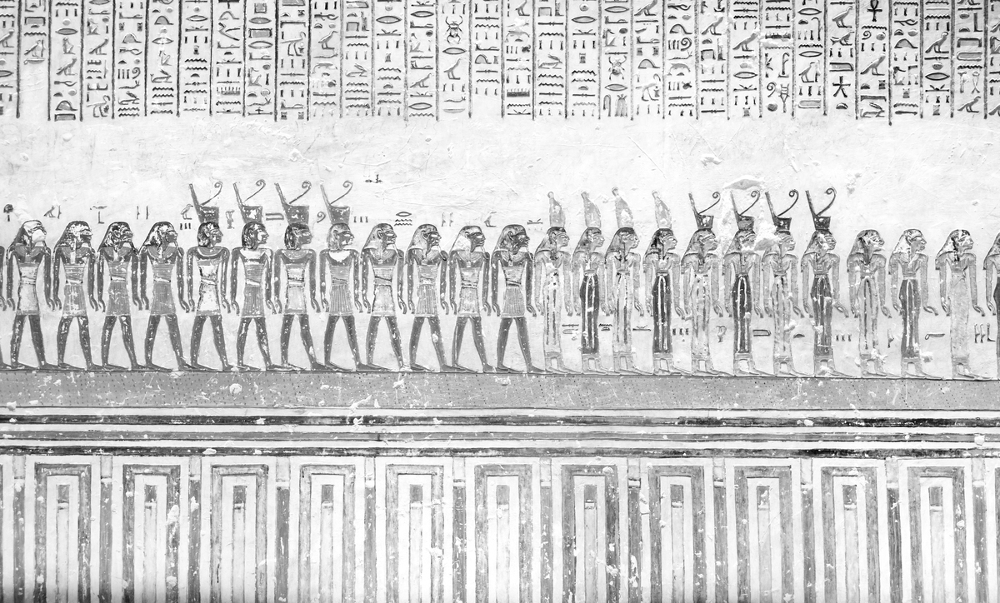
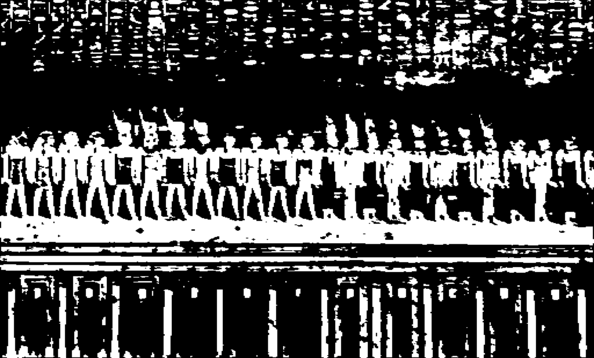
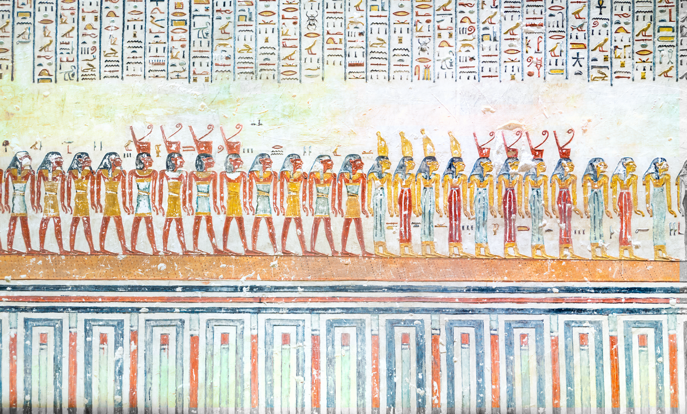

# Egyptian Relief Image Colorization using Deep Learning


## Overview

This project investigates automatic colorization of ancient Egyptian relief images using deep learning techniques.

Ancient Egyptian reliefs appear mostly grayscale today due to pigment degradation over time. The goal of this project is to reconstruct plausible color representations using a deep learning pipeline that combines segmentation-based hint generation and transformer-based image colorization.

The system is implemented in **PyTorch** and is based on the **IColoriT Vision Transformer architecture**.

---

## Example Result

Below is an example showing the full pipeline from grayscale relief image to the final reconstructed color output.

| Input Image                                        | Pigment Mask                                      | Colorized Output                                    |
| -------------------------------------------------- | ------------------------------------------------- | --------------------------------------------------- |
|  |  |  |

---

## Method Pipeline

The proposed system follows a **multi-stage pipeline**:

1. **Pigment Segmentation** using a **ResNet50-UNet model**
2. **Automatic Hint Generation** from segmented pigment regions
3. **Image Colorization** using the **IColoriT Vision Transformer**

### Pipeline Overview

Input Relief Image
↓
Pigment Segmentation (ResNet50-UNet)
↓
Automatic Hint Generation
↓
IColoriT Transformer Colorization
↓
Final Colorized Relief Image

---

## Repository Structure

```
color2/iColoriT/        → Transformer-based colorization implementation
data/test_images        → Example grayscale relief images
data/test_masks         → Segmentation masks
results                 → Example colorized outputs
```

---

## Technologies Used

* Python
* PyTorch
* OpenCV
* Vision Transformers
* Deep Learning
* Image Processing

---

## Thesis

This repository contains the implementation developed for the MSc thesis:

**Colorization of Egyptian Relief Images using Deep Learning**

University of Würzburg

📄 Thesis Report:
https://drive.google.com/file/d/1Je_2rfI6HW62-jpcxVK1mAwsxOZ5V4QL/view?usp=sharing

---

## Author

Sapana Gupta
MSc Computer Science
University of Würzburg
